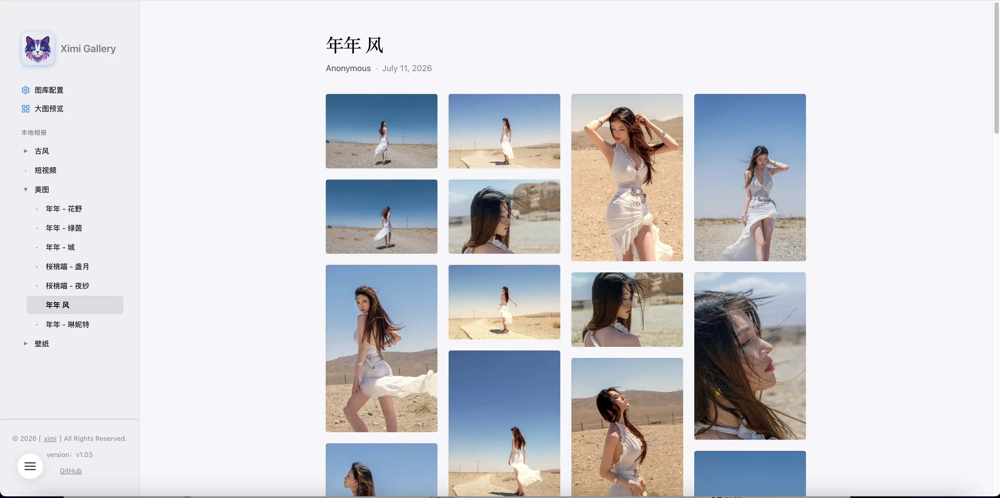
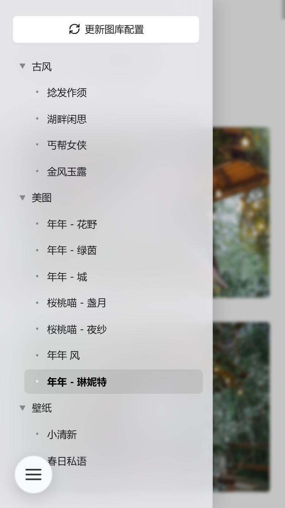
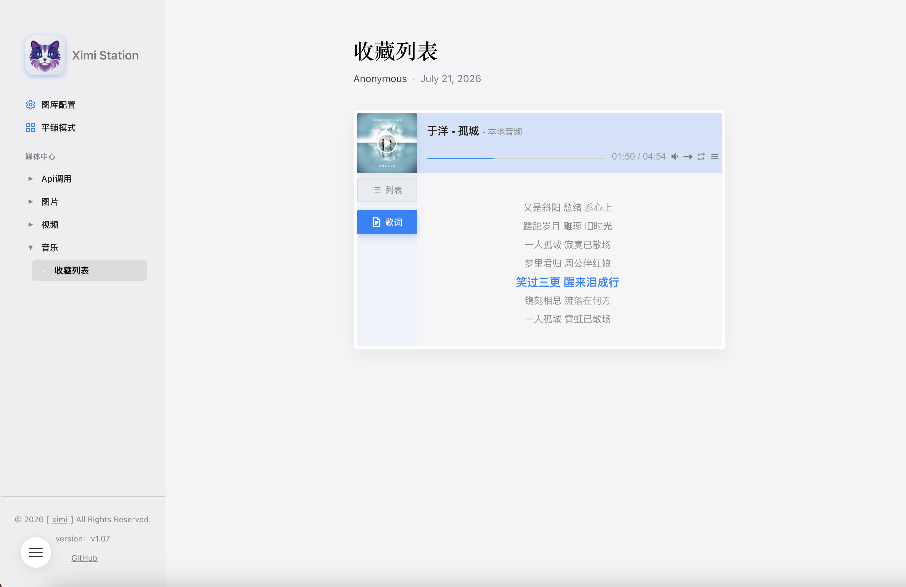

# Ximi-Station

本地 Web 多媒体中心，提供原生的浏览与视听体验。Telegraph 风格，macOS 化 UI，完美适配移动端。

## 核心功能

*   **全能多媒体支持**：全面支持图片浏览、视频播放以及音频播放。
*   **歌词同步显示**：音频播放器支持 `.lrc` 歌词同步，歌词文件需与音频同名且放置于同级目录下（**注意：需通过 HTTP 服务方式访问**）。
*   **PHP 密码保护**：提供 PHP 版本，支持设置访问密码，详情可参考 `index.php` 第 15-16 行的备注说明。
*   **自定义目录抓取 (`sach.php`)**：运行 `sach.php` 可灵活自定义目录来加载和管理媒体数据。
*   **多级目录预览**：支持多级子目录预览，提供比系统原生更便捷的交互体验。

## 使用方法

### 静态 HTML 部署方式
1. **选择媒体目录**：打开网页，点击左侧边栏的「更新图库配置」，选中当前目录内存储媒体的文件夹。
2. **保存配置文件**：浏览器会自动扫描目录内（包含子目录）的所有文件，并下载 `setting.js` 数据文件。
3. **替换并刷新**：将该配置文件移动至本网页所在目录（如提示重复则替换），按 `F5` 或 `⌘ R` 刷新即可生效。

### PHP / 服务端部署方式
*   将项目部署至支持 PHP 的本地或远程服务器环境中。
*   如需开启密码访问，可编辑 `index.php`，根据第 15-16 行的备注指引修改配置。
*   通过访问 `sach.php` 可按需自定义目录来获取媒体数据。

## 演示站点

[https://ximi-img.hhqq.net/](https://ximi-img.hhqq.net/)

## 界面预览

<table>
  <tr>
    <td></td>
    <td></td>
    <td></td>
  </tr>
</table>

## 配置说明

1. 网络图片视频加载实例可以查看目录内 `api.js`。
2. 本地环境可直接运行目录内的index.hmtl,php文件如用不上可删除;

## 📂 目录结构说明
```Plaintext
/ximi-Station
├── api.js            # 仅供演示使用，可根据需要自行删除.
├── sach.php          # 运行后可按需自定义目录来获取媒体数据并生成配置保存在本地.
├── check_cover.php   # 音乐模块 歌词与封面识别功能;
├── index.php         # http访问推荐,可自定义访问权限,具体见其内15-16行 有备注.如开启密码访问请删除hmtl文件!
├── index.html        # 与index.php功能一样,可本地直接运行,但是歌词功能失效,http访问歌词功能不影响.
├── setting.js        # 运行sach.php或是前台选择图库配置后自动生成的配置文件.
└── README.md         # 项目文档.
```
## 关于

*   作者：希米
*   原文：[https://www.ximi.me/post-6044.html](https://www.ximi.me/post-6044.html)
*   最后更新：2026-07-21
